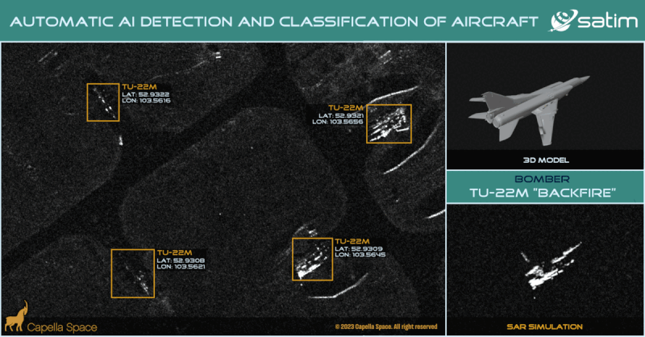

# Surveillance RC Aircraft
Pesawat RC otomatis untuk pengintaian dengan fitur canggih seperti navigasi GPS, pengambilan gambar/video, kestabilan penerbangan, penghindaran rintangan, transmisi data real-time, kontrol manual, dan kemampuan stealth.

## Fitur
- Navigasi GPS
- Pengambilan gambar/video
- Kestabilan penerbangan
- Penghindaran rintangan
- Transmisi data real-time
- Kontrol manual
- Kemampuan stealth

## Komponen yang Dibutuhkan
- Arduino Mega 2560
- GPS Module (NEO-6M)
- Kamera (OV7670)
- IMU Sensor (MPU6050)
- Motor Brushless dan ESC
- Propeller
- Baterai Li-Po
- Frame pesawat atau drone
- Transceiver (NRF24L01)
- Ultrasonic sensor (HC-SR04)
- Servo motor
- Material stealth
- Breadboard dan kabel jumper

## Bahasa Pemrograman
- C/C++ (Arduino)
- Python (pengolahan data lanjutan jika diperlukan)

## Langkah-langkah Pembuatan
- **Rangkaian Elektronik**: Sambungkan semua komponen sesuai dengan pin yang dibutuhkan.
- **Pengkodean**: Tulis dan unggah kode ke Arduino Mega.
- **Pengujian dan Kalibrasi**: Uji semua fitur dan kalibrasi sensor untuk memastikan kinerja yang optimal.

## Struktur File
- `main.ino`: Kode utama untuk mengontrol pesawat.
- `stealth.ino`: Kode untuk mengaktifkan mode stealth.
- `avoidObstacle.ino`: Kode untuk penghindaran rintangan.

## Galeri

## Lisensi
Proyek ini dilisensikan di bawah [MIT License](LICENSE).

## Kontribusi
Silakan buka issue atau pull request jika ingin berkontribusi pada proyek ini.